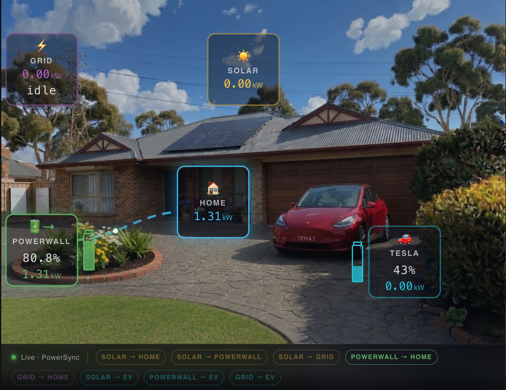
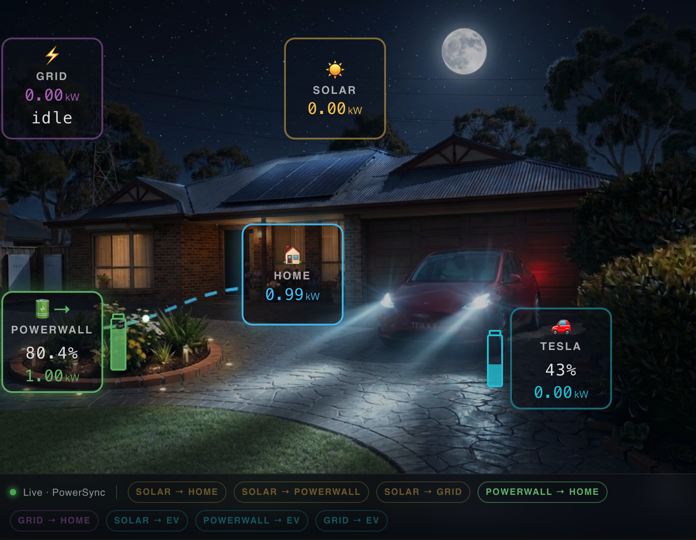
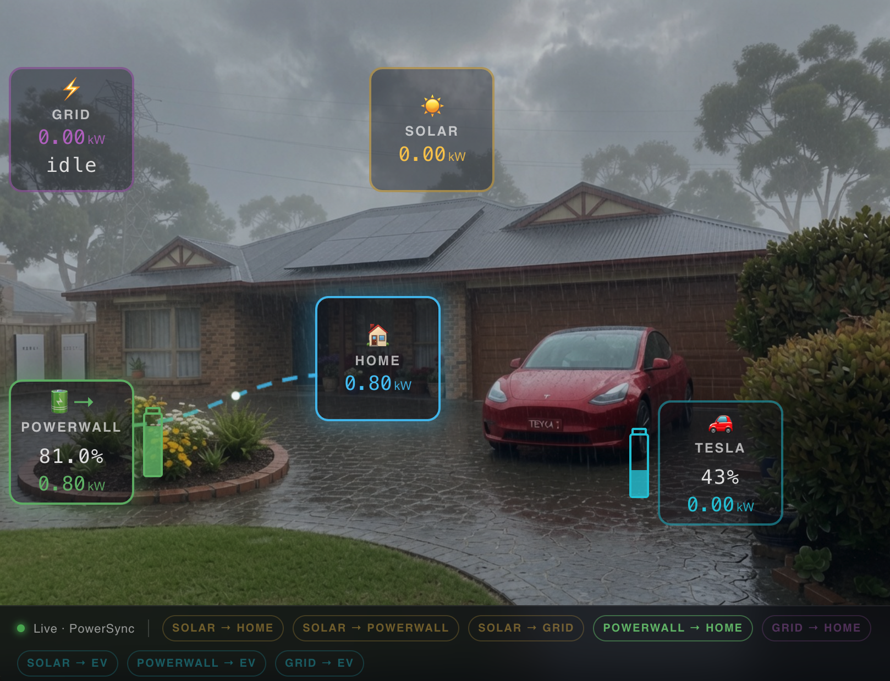

# Energy Flow Card

A custom [Home Assistant](https://www.home-assistant.io/) Lovelace card that displays real-time energy flow between Solar, Home, Battery, Grid and EV nodes — with animated bezier flow lines, pulse animations, battery gauges, and automatic weather/time-based background image switching.





---

## Features

- **5 energy nodes** — Solar, Home, Battery, Grid, EV
- **Animated flow lines** — bezier curves with travelling dots, speed proportional to power
- **Pulse ring animations** — nodes glow when active
- **Battery gauges** — vertical battery-shaped charge indicators on Battery and EV nodes
- **Weather-based backgrounds** — automatically switches between day/night and clear/rain/heavy-rain images using `sun.sun` and your weather entity
- **Fully configurable via YAML** — node positions, entity IDs, opacity, animations, background images
- **Live updates** — powered by Home Assistant's WebSocket connection, no polling

---

## Installation

### Manual

1. Download `energy-flow-card.js` and copy it to `/config/www/`
2. In Home Assistant go to **Settings → Dashboards → Resources**
3. Add resource: URL `/local/energy-flow-card.js`, Type: `JavaScript module`
4. Add a card to your dashboard with `type: custom:energy-flow-card`

### HACS (coming soon)

---

## Configuration

```yaml
type: custom:energy-flow-card

# ── Background images ──────────────────────────────────────────
# Supports day/night and clear/light-rain/heavy-rain variants.
# All are optional — omit any you don't have.
background:                  /local/day.jpg
background_night:            /local/night.jpg
background_day_rain:         /local/day-rain.jpg
background_day_heavy_rain:   /local/day-heavy-rain.jpg
background_night_rain:       /local/night-rain.jpg
background_night_heavy_rain: /local/night-heavy-rain.jpg

# ── Weather entity (used for background switching) ─────────────
# Defaults to weather.home if not set
weather_entity: weather.your_location

# ── Node appearance ────────────────────────────────────────────
node_opacity: 0.4       # 0.0 (transparent) to 1.0 (opaque), default 0.4
node_animation: true    # Pulse ring animation, default true

# ── Entity IDs ─────────────────────────────────────────────────
# battery_power: negative = charging, positive = discharging
# grid_power:    negative = export,   positive = import
entities:
  solar:         sensor.solar_power
  home:          sensor.home_load
  powerwall:     sensor.battery_power
  powerwall_pct: sensor.battery_level
  grid:          sensor.grid_power
  ev_power:      sensor.ev_charging_power
  ev_pct:        sensor.ev_battery_level

# ── Node positions (% of card width/height) ────────────────────
nodes:
  solar:     { left: 48, top: 20 }
  home:      { left: 55, top: 50 }
  powerwall: { left: 15, top: 60 }
  grid:      { left: 15, top: 25 }
  ev:        { left: 80, top: 65 }

# ── Card sizing ────────────────────────────────────────────────
grid_options:
  columns: 12
  rows: 8
```

---

## Entity conventions

| Entity key | Sign convention |
|---|---|
| `powerwall` | Negative = charging, Positive = discharging |
| `grid` | Negative = exporting to grid, Positive = importing from grid |

---

## Flow logic

| Flow | Condition |
|---|---|
| Solar → Home | Solar > 50W and Home > 50W |
| Solar → Battery | Solar > 50W and Battery charging |
| Solar → Grid | Solar > 50W and Grid exporting |
| Battery → Home | Battery discharging |
| Grid → Home | Grid importing > 400W |
| Solar → EV | EV charging and Solar active and not importing |
| Battery → EV | EV charging and Battery discharging |
| Grid → EV | EV charging and Grid importing |

---

## Background image switching

The card automatically selects the background image based on:
- **Time of day** — uses `sun.sun` state (`above_horizon` / `below_horizon`)
- **Weather** — uses your `weather_entity` state:
  - `rainy`, `snowy-rainy`, `hail`, `lightning-rainy` → light rain image
  - `pouring` → heavy rain image
  - anything else → clear image

---

## Tips

- Set the card height using `grid_options: rows: N` in the card YAML, or drag the resize handle in the Lovelace UI
- Node positions use percentage values so they scale with card size
- The battery node label defaults to "Battery" — rename it by editing the JS or by contributing a `node_label` config option

---

## Contributing

Pull requests welcome! Some ideas for future improvements:
- Configurable node labels via YAML
- Configurable flow thresholds via YAML
- Additional node types (e.g. heat pump, pool pump)
- HACS integration

---

## Credits

Developed by [Steve-gnome](https://github.com/Steve-gnome) with assistance from Claude (Anthropic).

Licensed under MIT.
